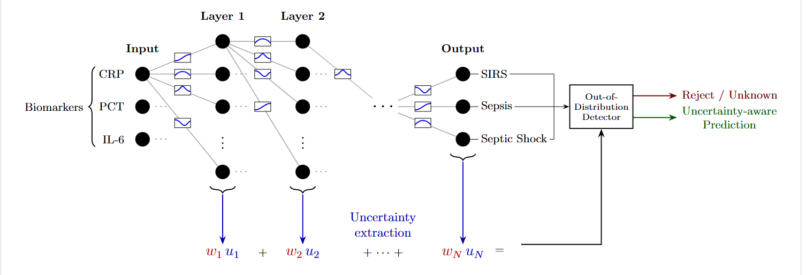

# Uncertainty-Aware KAN for Out-of-Distribution Detection

> Paper submitted to **CIBCB 2026** (IEEE Conference on Computational Intelligence in Bioinformatics and Computational Biology).

## Overview

This repository contains the implementation of **UA-KAN** (Uncertainty-Aware Kolmogorov-Arnold Network), a novel architecture for classification with built-in out-of-distribution (OoD) detection.

The method is evaluated on two medical tabular datasets against ten baseline models, using AUROC as the OoD detection metric.

---

## UA-KAN Architecture



UA-KAN replaces the B-spline univariate functions of the original KAN with Radial Basis Functions (RBFs), improving training efficiency. Each activation is computed as a weighted combination of a learnable RBF and a custom RBF-SiLU residual. The RBF kernel width is also trainable, allowing the model to adapt the locality of each activation to the data.

The RBF activations provide a natural uncertainty signal: for in-distribution inputs, activations concentrate near learned grid centers (low entropy); for OoD inputs, no center is strongly activated and the distribution becomes near-uniform (high entropy). The per-layer uncertainty is the mean entropy of the normalised RBF activation distributions across input features.

Two scoring variants are evaluated: a simple variant using only the final layer's entropy, and a weighted variant that aggregates all layer uncertainties using weights proportional to the variance of each layer's activations over the training set. The model is trained with a composite loss combining Cross-Entropy and Logit Norm to jointly optimise accuracy and calibration.

## Datasets

| Dataset | Task | Samples | Features | Classes |
|---|---|---|---|---|
| Ambrosia | Sepsis severity (ICU) | ~750 | 3 biomarkers | 3 (SIRS / Sepsis / Septic Shock) |
| Heart Disease UCI | Cardiac diagnosis | ~920 | 13 | 2 (binary) |

OoD evaluation uses three held-out sklearn datasets (Wine, Iris, Breast Cancer) and a Gaussian-noised version of the training set.

---

## Baselines

| Model | Type |
|---|---|
| MLP | Standard feedforward |
| Energy MLP | MLP with energy score OoD |
| MC Dropout | Bayesian approximation |
| Deep Ensembles | Ensemble of MLPs |
| KAN | Kolmogorov-Arnold Network |
| FastKAN | RBF-based KAN |
| DUQ | Deterministic Uncertainty Quantification |
| FT-Transformer | Feature Tokenizer Transformer |
| TabNet | Attentive tabular network |
| TabPFN | In-context learning transformer |
| XGBoost | Gradient boosted trees |

---

## Installation

```bash
pip install torch scikit-learn pandas numpy openpyxl tqdm
pip install pytorch-tabnet tabpfn xgboost kagglehub
```

---

## Datasets Setup

**Ambrosia** — place `ambrosia.xlsx` in `./datasets/`.

**Heart Disease UCI** — downloaded automatically via `kagglehub` on first run, or place `heart_disease_uci.csv` in `./datasets/` manually.

---

## Training

```bash
# UA-KAN
python3 train_UA_KAN.py --dataset ambrosia --architecture 3 32 3
python3 train_UA_KAN.py --dataset heart --architecture 13 32 2

# Baselines
python3 train_MLP.py --dataset ambrosia --architecture 3 32 3
python3 train_DUQ.py --dataset ambrosia
```

Key arguments for `train_UA_KAN.py`:

| Argument | Default | Description |
|---|---|---|
| `--architecture` | `3 32 3` | Layer sizes including input and output |
| `--grids` | `4` | RBF grid points per dimension |
| `--learning_rate` | `0.001` | SGD learning rate |
| `--weight_decay` | `1e-4` | L2 regularisation |
| `--epochs` | `50` | Training epochs |
| `--model_num` | `5` | Independent runs (mean ± std reported) |
| `--loss` | `proposed` | `proposed` or `ce` |
| `--dataset` | `ambrosia` | `ambrosia` or `heart` |